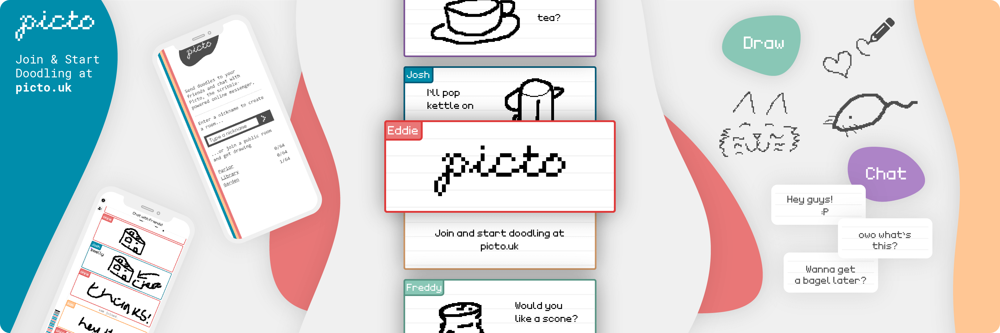

Send doodles to your friends and chat with Picto, the scribble-powered online messenger.

 

## :memo: About Picto

Picto is a drawing-based chat client, built with Vue.js and Golang. It makes use of WebSockets for real-time updates, and modern browser technologies for responsive, fluid design.

Go was chosen for the backend for it's performance and low memory usage, in comparison with Node.js.

### Usage

Get started with Picto by joining or creating a room. Share the room you're in and invite friends with one click on the user icon in the top left.

To doodle, select the pencil tool and use a finger or your mouse to draw in the message box at the bottom of the screen. Typing is also supported, and on mobile tap the keyboard icon to show an on-screen keyboard.

To leave the room, click the open door icon.

## :bookmark_tabs: Documentation

All documentation can either be found in this document ([README.md](README.md)) or in the [docs folder](docs).

- [API.md](docs/API.md) contains information about the WebSocket protocol, and the HTTP API.

## :beetle: ​Issues

Found a bug? Please report it [here](https://github.com/onfe/Picto/issues?q=is%3Aissue+is%3Aopen+label%3Abug) so we can fix it.

If you want to help [fix an issue](https://github.com/onfe/Picto/labels/good%20first%20issue), shoot us a message or open a pull request and we'll get back to you.

## :wave: Credit and thanks

Picto is developed and maintained by:

- Edward (onfe) - https://onfe.uk/
- Josh (TheTeaCat) - https://joshuarainbow.co.uk/
- Freddy - https://freddyheppell.com/

Thanks to all our friends and families who dealt with the late nights, tested Picto, shared it around and provided support and enthusiasm.

:triangular_flag_on_post: Icons by [Font Awesome](https://fontawesome.com/)